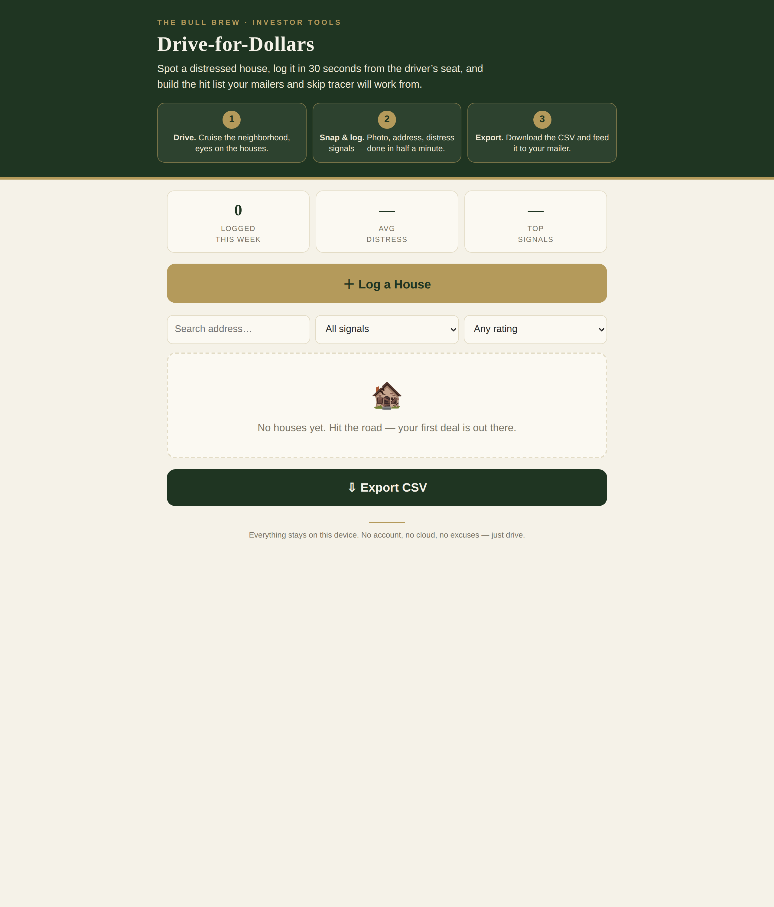

# Drive-for-Dollars — Distressed House Logger

**Live:** https://thebullbrew.github.io/drive-for-dollars/

Spot a distressed house, log it in 30 seconds from the driver's seat, and build the hit list your mailers and skip tracer will work from.

## How it works

1. **Drive.** Cruise the neighborhood, eyes on the houses.
2. **Snap & log.** Photo, address, distress signals — done in half a minute.
3. **Export.** Download the CSV and feed it to your mailer.

## Features

- **30-second log flow** — big touch targets, checklists over typing, built for one-handed use in the car
- **GPS address fill** — "Locate" reverse-geocodes your position via BigDataCloud when online; manual entry always available
- **Photo capture** — snaps compressed on-device so they never fill your phone
- **Distress-signal checklist** — overgrown lawn, boarded windows, tarp on roof, piled-up mail, peeling paint, vacant-looking, code notice posted
- **1–5 distress rating, ARV guess, and notes** per house
- **Hit list** — card grid with photo, address, signal tags, and date; tap for full detail
- **Filters** — by signal, by minimum rating, and address search
- **Stats strip** — houses logged this week, average distress, top signals
- **CSV export** — one tap, ready for mail merge and skip tracing
- **Fully offline PWA** — everything stays in your browser's local storage; install it and drive

## Privacy

No account, no cloud, no tracking. Every entry lives on your device.
